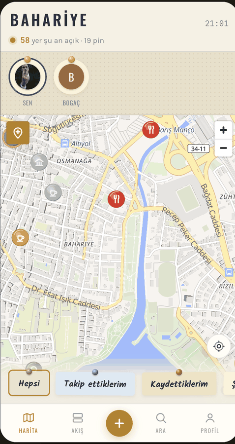
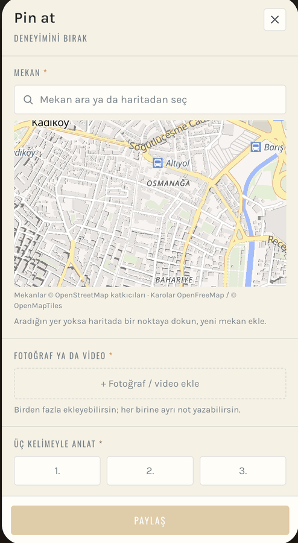

# Kadıköy Harita

Şehir keşif uygulaması. Merkezinde harita var; üstünde kullanıcıların pinlediği
mekanlar ve o mekanlara bıraktıkları deneyim notları duruyor.

**Canlı:** https://kadikoy-harita.vercel.app · **English:** [README.md](README.md)

<p align="center">
  
  
</p>
<p align="center"><sub>Harita · pin formu</sub></p>

---

## Neden

Fikir bir Barcelona seyahatinden çıktı: turist olarak yemek ya da gezi mekanı bulmak
için TikTok ve Instagram'ı tek tek taramak yorucu, üstelik asıl kritik bilgi eksik
kalıyor — rezervasyon gerekiyor muymuş, mekan o gün kapalıymış.

Google Maps "burada ne var" sorusuna cevap veriyor. Bu uygulama
**"gitmeden ne bilmem lazım"** ve **"bana uygun mu"** sorularına cevap veriyor.
Ürünün her kararı bu ayrımdan türedi.

---

## Değerlendirme sistemi

Tek yıldız yok. Google Maps'te her yer 4.3 çıkıyor ve hiçbir şey ayırt edilmiyor,
çünkü yıldız "ne kadar iyi" ölçüyor. Buradaki alanlar "**bana** uygun mu" ölçüyor.

**Pin atarken zorunlu:** fotoğraf · üç kelime · geliş senaryosu · bana hitap puanı (1–10) · somut not (≥15 karakter)

**İsteğe bağlı:** bir şey değişse · hangi sıklıkla gelinir · tekrar gider misin · kişi başı ödenen · servis · atmosfer · fiyat-performans

Zorunlu alanlar bir kalite kapısı: fotoğraf ve somut not istendiğinde "çok güzeldi"
yazan üşengeç pin kendiliğinden eleniyor. Moderasyon yerine formun kendisi filtreliyor.
Formun kendisi yukarıdaki ikinci ekran görüntüsünde.

Mekan sayfasında **ortalama gösterilmiyor, dağılım gösteriliyor:**

- Üç kelimeler → frekansa göre kelime bulutu; mekanın kimliği bu
- Puanlar → 1–10 dağılım çubuğu, ayrıca **takip ettiklerinin ayrı ortalaması**
  (zevkine güvendiğin beş kişi 8 verdiyse kalabalığın 6.5'i seni ilgilendirmiyor)
- "Bir şey değişse" notları → alt alta liste; pratikte mekanın yapılacaklar listesi

---

## Üç yüzey

| Yüzey | İş |
|---|---|
| **Harita** | Nerede ne var. Açılış ekranı; keşif yüzeyi bu. |
| **Akış** | Kim ne paylaştı. Üç sekme — Keşfet (beğeni ÷ tazelik), Popüler (ham beğeni, haftalık), Takip (kronolojik). Üçünün sıralaması kasıtlı olarak farklı. |
| **Profil** | Kişinin kendi haritası. `/@kullanici` bağlantısı dışarıda paylaşılabilir. |

---

## Teknik

**Next.js 16** (App Router) · **React 19** · **TypeScript** · **Tailwind CSS 4**
**Supabase** — Postgres + PostGIS, Row Level Security, Storage, Auth
**MapLibre GL** — harita karoları OpenFreeMap üzerinden

Yaklaşık 9.300 satır, 53 dosya, 17 veritabanı göçü.

### Öne çıkan teknik kararlar

- **Güvenlik anahtarda değil, veritabanında.** `anon` anahtarı zaten istemci
  paketine giriyor; kimin neyi görüp yazabileceği tamamen `schema.sql` içindeki
  RLS politikalarında tanımlı. `service_role` anahtarı hiçbir yerde kullanılmıyor.
- **Coğrafi sorgular PostGIS'te.** Mekan arama, yakınlık ve Kadıköy sınırı kontrolü
  istemcide değil veritabanında çalışıyor.
- **MapLibre worker'ı elle servis ediliyor.** MapLibre worker'ı kendi içinde string
  URL'den kurduğu için Turbopack bundle'a almıyor ve harita boş kalıyor; worker
  `public/maplibre/` altından veriliyor (`scripts/maplibre-worker-kopyala.mjs`,
  `predev`/`prebuild` adımında çalışır).
- **Demo hesaplar salt-okunur.** Depo herkese açık olduğu için demo hesapların
  şifresi de açık; buna karşılık bu hesaplar veritabanı düzeyinde hiçbir şey
  yazamıyor (`public.demo_hesap()`, `scripts/goc/15-demo-salt-okunur.sql`).
  Kısıt arayüzde değil RLS'te olduğu için API'ye doğrudan istek atmak da işe yaramıyor.
- **Next.js 16 geçişi.** `middleware.ts` → `proxy.ts` olarak yeniden adlandırıldı;
  Supabase oturum yenilemesi buna göre yazıldı.

---

## Yapı

```
.
├── schema.sql                 # veritabanı şeması + RLS politikaları
├── BRIEF.md                   # ürün kararları ve gerekçeleri
├── kadikoy-harita-mimari.md   # mimari notlar
├── prototip.html              # tasarım referansı (çalışan arayüz prototipi)
├── docs/                      # README ekran görüntüleri
└── web/
    ├── app/                   # App Router sayfaları ve route handler'ları
    ├── components/            # arayüz bileşenleri
    ├── lib/                   # veri erişimi, sıralama, coğrafya, oturum
    └── scripts/
        ├── goc/               # veritabanı göçleri (sırayla çalıştırılır)
        └── tohum/             # demo veri üretimi
```

---

## Kurulum

```bash
git clone https://github.com/toprakbogachan-max/kadikoy-harita.git
cd kadikoy-harita/web
npm install
cp .env.local.example .env.local   # Supabase URL + anon key doldur
npm run dev
```

Veritabanı için Supabase'de yeni bir proje aç, `schema.sql` dosyasını SQL Editor'de
çalıştır, ardından `web/scripts/goc/` altındaki göçleri numara sırasıyla uygula.

`.env.local` git'e girmez.

---

## Tasarım

Metafor **mantar pano**: harita pano, mekanlar toplu iğne, yorumlar iğnelenmiş
post-it'ler. Tema açık ve kağıt tonlarında — zemin `#F6F1E4`, pano `#E9DFC9`,
mürekkep `#23343C`, vurgu pirinç `#B8801A`. Oswald (tabela), Karla (metin),
JetBrains Mono (sayı).

---

## Durum

Aktif geliştirmede. Tek şehir, tek semt — İstanbul / Kadıköy. Hedef yaklaşık
200 mekan, boş harita ürünü öldürdüğü için ilk içerik elle dolduruluyor.

---

## Lisans

MIT — `LICENSE` dosyasına bakın.
